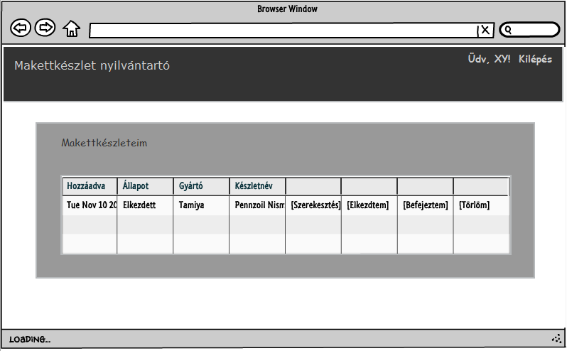
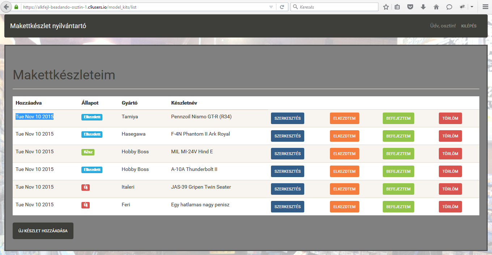
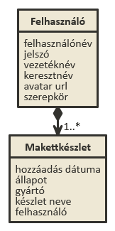
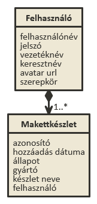
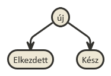
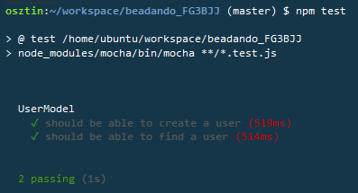

# Alkalmazások fejlesztése első beadandó
## Makettkészlet nyilvántartó alkalmazás

***

###Követelményanalízis

A program regisztrált és hitelesített felhasználók számára nyújt lehetőséget makettkészleteik nyilvántartására.

Funkcionális elvárások:
  + Lehetőség legyen az oldalon a regisztrációra felhasználók számára
  + Lehetőség legyen be és kilépésre regisztrált felhasználóknak
  + Bejelentkezett felhasználók számára listázza az alkalmazás a saját makettkészleteiket
  + Lehetőség legyen új készlet hozzáadására a bejelentkezett felhasználó listájához
  + Lehetőség legyen már a listához adott készletek szerkesztésére, állapotuk megváltoztatására, valamint törlésükre

Nem funkcionális elvárások:
  + Könnyű kezelhetőség
  + Átlátható, reszponzív dizájn

Szakterületi fogalomjegyzék: nincsenek speciális szakkifejezések.

Használatieset-modell
  Szerepkörök: 
  + vendég: a főoldal tartalmához fér hozzá, regisztrálhat, vagy beléphet az oldalra
  + felhasználó: bejelentkezés után az oldal összes funkcióját elérheti
  
Használati eset diagram:

Lehetséges folyamat példa:

***

###Tervezés

Architektúra terv:
  + Publikus:
    + Főoldal
    + Regisztráció
    + Login
  + Felhasználó:
    + Főoldal
    + Login/Logout
    + Makettkészleteinek listája
        + új készlet hozzáadása
        + meglévő készlet szerkesztése
        + meglévő készlet állapotának változtatása
        + meglévő készlet törlése

Végpontok:
  + GET /: főoldal
  + GET /login: bejelentkező oldal
  + POST /login: bejelentkezési adatok felküldése
  + GET /model_kits/list: saját makettkészleteket listázó oldal
  + GET /model_kits/new: új makettkészlet hozzáadása
  + POST /model_kits/new: új makettkészlet hozzáadása, adatok felküldése
  + GET /model_kits/edit/:id : makettkészlet szerkesztése
  + POST /model_kits/edit/:id : makettkészlet szerkesztése, adatok felküldése
  + GET /model_kits/delete/:id : makettkészlet törlése
  + GET /model_kits/started/:id : makettkészlet állapotának változtatása "Elkezdett"-re
  + GET /model_kits/done/:id : makettkészlet állapotának változtatása "Kész"-re
  + GET /logout: kijelentkezés

Felhasználóifelület-modell:
  + Oldalvázlat:
  
  
  + Megvalósítva:
  

Osztálymodell:
  + Adatmodell:
  
  
  
  + Adatbázisterv:
  
  
  
  + Állapotdiagram (makettkészlet):
  
  

  + Dinamikus működés:
    Az alkalmazás 'hbs' fájlokkal dinamukusan változtatja a nézeteit.

***

###Implementáció

1. Fejlesztői környezet bemutatása:
    az alkalmazást a Cloud9 Web IDE segítségével online hoztam létre és szerkesztettem. Ezen belül használtam a           terminált is, így teljesen felhőben lehetett megvalósítani a programot. Futtatókörnyezetként is a Web IDE szolgált a fejlesztés során.

2. Könyvtárstruktúrában lévő mappák funkiójának bemutatása:
    + config: a "Waterline" konfigurációját tartalmazza
    + controllers: az alkalmazás MVC struktúrájának vezérlő egységeit tartalmazza
    + models: az alkalmazás MVC struktúrájának modell egységeit tartalmazza
    + node_modules (és almappái): különböző modulok telepítési helye a "Node.js"-hez
    + public (és almappái): az oldal megjelnítéséhez szükséges állományokat (css, képek, stb...) tartalmazza
    + views (és almappái): az alkalmazás MVC struktúrájának megjelenítő egységeit tartalmazza

***

###Tesztelés

Tesztelési környezet bemutatása:
  + Az egységtesztek végzését a Web IDE-n belül hajtottam végre, "mocha" és "chai" modulok telepítése és konfigurálása után, tesztállomány létrehozásával, majd az "npm test" paranccsal
  + A funkcionális felületi teszteket Selenium IDE segítségével, illetve manuálisan végeztem

Egységtesztek: 
  + User model tesztelése:
  
  

Funkcionális felületi tesztek:
  
Tesztesetek felsorolása: 
  + User model tesztelése sikeres mocha és chai segítségével
  + Manuálisan az összes funkcionális teszt sikeres

***

###Felhasználói dokumentáció

Rendszerigény: 
  + Modern böngészőket futtató hardver
  + Internetkapcsolat

Telepítés: nem szükséges telepíteni az alkalmazást, elérhető Heroku segítségével online böngészőből.

A program használata:
  + Regisztráció: a felhasználónak regisztrálnia kell néhány adat megadásával
  + Bejelentkezés: a felhasználó felhasználóneve és jelszava segítségével be kell, hogy jelentkezzen az alkalmazás használatához
  + Ha bejelentkezett, makettkészletéhez az "Új készlet hozzáadása" gombbal adhat újabb készletet
  + Ha van rögzítve a listában makettkészlet, akkor adott készlet szerkesztéséhez a "Szerkesztés" gombot, állapotváltoztattáshoz az "Elkezdtem", vagy a "Befejeztem" gombot, valamint törléhez a "Törlöm" gombot használhatja
  + Ha be van jelentkezve az adott felhasználó, a "Kilépés" gombra kattintva kijelentkezhet 
