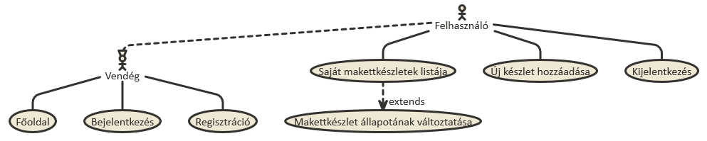
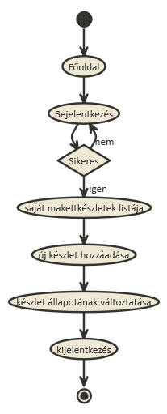

# Alkalmazások fejlesztése első beadandó
## Makettkészlet nyilvántartó alkalmazás

***

###Követelményanalízis

A program regisztrált és hitelesített felhasználók számára nyújt lehetőséget makettkészleteik nyilvántartására.

Funkcionális elvárások:
  + Lehetőség legyen az oldalon a regisztrációra felhasználók számára
  + Lehetőség legyen be és kilépésre regisztrált felhasználóknak
  + Bejelentkezett felhasználók számára listázza az alkalmazás a saját makettkészleteiket
  + Lehetőség legyen új készlet hozzáadására a bejelentkezett felhasználó listájához
  + Lehetőség legyen már a listához adott készletek szerkesztésére, állapotuk megváltoztatására, valamint törlésükre

Nem funkcionális elvárások:
  + Könnyű kezelhetőség
  + Átlátható, reszponzív dizájn

Szakterületi fogalomjegyzék: nincsenek speciális szakkifejezések.

Használatieset-modell
  Szerepkörök: 
  + vendég: a főoldal tartalmához fér hozzá, regisztrálhat, vagy beléphet az oldalra
  + felhasználó: bejelentkezés után az oldal összes funkcióját elérheti
  
Használati eset diagram:

Lehetséges folyamat példa:

Tervezés
Implementáció
Tesztelés
Felhasználói dokumentáció
